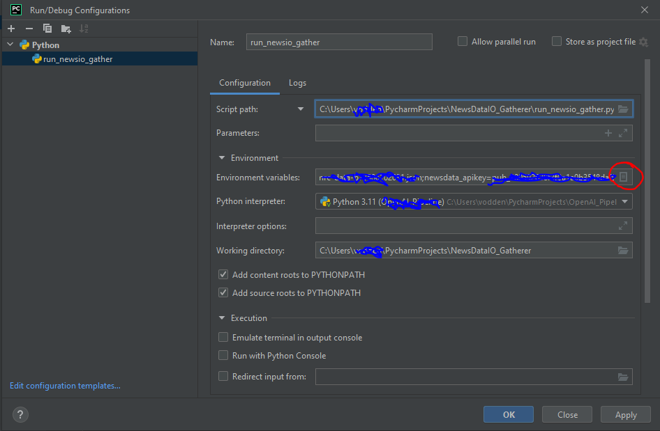
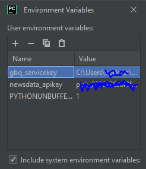

# NewsdataIO News Gatherer

Uses the NewsData API to request news content and push results to a specified Google BigQuery database.

For more details, go to: https://newsdata.io/documentation


## What you will need

- Python 3.10 or newer
- A Google BigQuery service account
- A NewsDataIO API key

<br>

## How to use this tool


### 1. <b>Set your environment variables.</b>
In Pycharm, this can be done by going to `Run` -> `Edit Configurations` -> `Environment Variables` 
>
> 
<b>You will need:</b>

| Name                   | Value                            |
|------------------------|----------------------------------|
| <b>gbq_servicekey</b>  | `/path/to/your/credentials.json` |
| <b>newsdata_apikey</b> | your newsdataio api key (value)  |

Ensure that the name of your credentials are exactly as above, and that your path and key values are correct for your specific setup:



<br>

### 2. <b> Install requirements</b>
`pip install -r requirements.txt`

<br>

### 3. <b> Enter your config details in `config.yml`. An example of a valid configuration is shown below:</b>
```
# SearchParams:

endpoint: 'archive'     # 'archive' or 'news'
domains: ['7news', 'skynewsau', 'sbs', ..., 'smh', 'thewest', 'theage', 'couriermail']

query: '*'
date_from: '2024-03-01'
date_to: '2024-03-03'

country: 'au'       # Examples: au=Australia, de=Germany
language: 'en'      # Examples: en=English/de=german

# Google BigQuery Params
project_name: 'your-gbqproject'
dataset_name: 'newsdataio_data'
tablename: 'newsdata_news_au'
```

### 4. Run `run_newsio_gather.py`

This will call `collector.py` to gather news articles from the NewsDataIO API and push the results to Google BigQuery.

## Data output


 TODO

